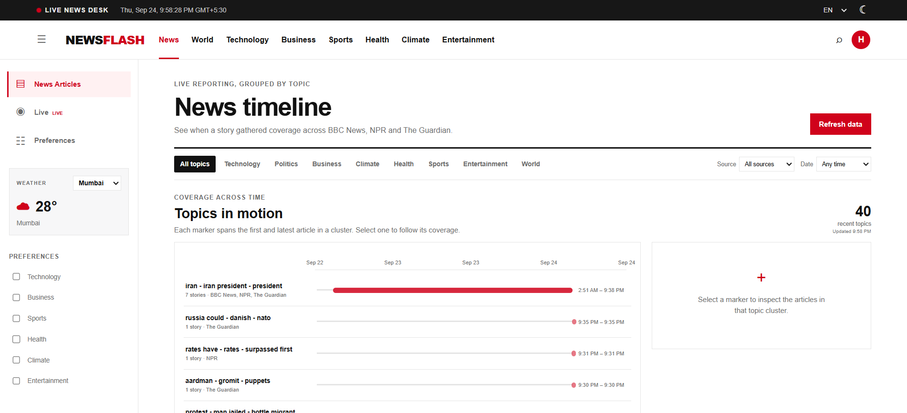
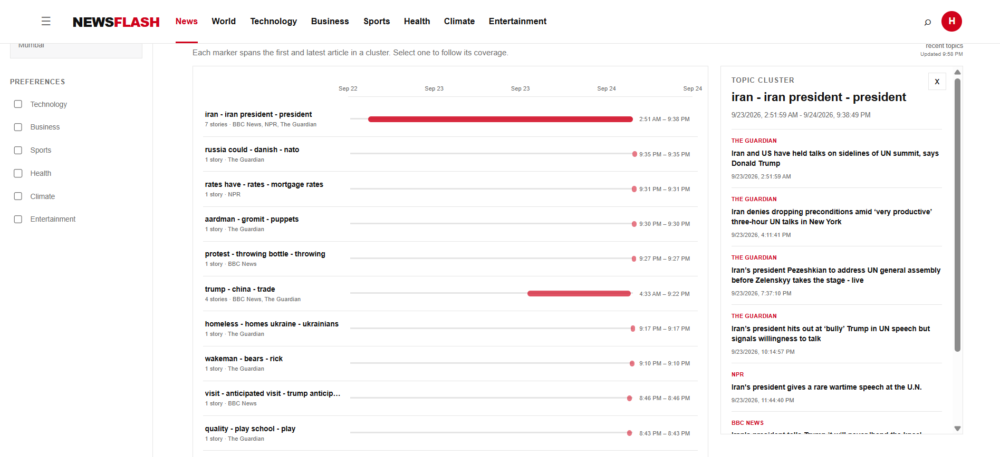
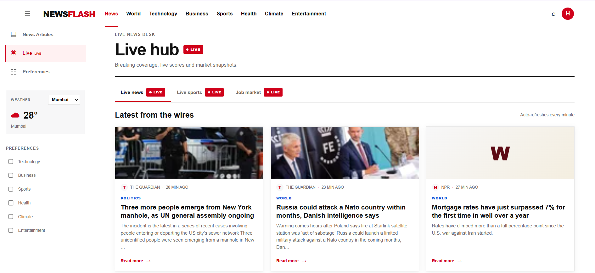

# NewsFlash

**A live news coverage explorer that groups related reporting into topic clusters.** NewsFlash collects recent stories from BBC News, NPR, and The Guardian, groups textually related coverage, and presents it as a timeline and a live-news feed.

## Live project

- **Frontend:** [newsflash-1-nssj.onrender.com](https://newsflash-1-nssj.onrender.com)
- **Backend API:** [newsflash-orxd.onrender.com](https://newsflash-orxd.onrender.com)
- **Health check:** [API health](https://newsflash-orxd.onrender.com/health)
- **Video walkthrough:** Add the required 2–3 minute recording link here before submission.

The first request can take longer if the Render service has been idle and needs to wake up.

## Screenshots

### News timeline and topic coverage



### Articles in a selected topic cluster



### Live news hub



## What it does

- Fetches recent RSS items from **BBC News, NPR, and The Guardian**.
- Attempts to extract article-page text and images; if extraction fails, it retains the RSS title and summary so an individual publisher page does not stop ingestion.
- Avoids inserting the same story URL more than once.
- Uses TF-IDF and cosine similarity to group stories with overlapping headline terms.
- Displays topic clusters on a timeline, with source and date filters and a panel for reading the articles in a selected cluster.
- Supports account registration and sign-in. Passwords are hashed with bcrypt; access and refresh tokens are used for sessions.
- Includes a responsive interface, light/dark theme, English/Hindi/Marathi interface labels, a live clock, and weather by selected city.
- Includes a Live hub. Its news tab uses collected news; sports fixtures and job-market figures are demo/mock data and should not be presented as verified live statistics.

## Architecture and data flow

```text
BBC / NPR / The Guardian RSS feeds
                 |
                 v
Python scraper: fetch -> normalize -> extract -> deduplicate -> group
                 |
                 v
MongoDB Atlas (articles and topic clusters)
                 |
                 v
Express REST API (authentication, timeline, articles, ingestion)
                 |
                 v
Next.js / React frontend
```

The **Refresh data** action calls the protected ingestion endpoint. The Express backend launches the Python scraper, which stores refreshed articles and clusters in MongoDB. The frontend polls the job status and reloads the timeline when ingestion finishes. The backend also starts an ingestion and schedules another every five minutes while the process is awake. On Render's free web service, sleeping pauses this in-process schedule; it is not a 24/7 background worker.

## Topic grouping

The grouping implementation is in [`scraper/nlp/cluster.py`](scraper/nlp/cluster.py). It builds TF-IDF vectors from each article's headline (weighted by repeating it) and RSS summary. `TfidfVectorizer` considers single words and two-word phrases, with up to 5,000 features. It then computes cosine similarities and uses DBSCAN with a precomputed distance matrix.

To avoid joining stories on vague summary overlap alone, a pair is considered close when either:

- similarity is at least `0.38` and the headlines share at least one processed term; or
- similarity is at least `0.22` and the headlines share at least two processed terms.

DBSCAN uses `eps=0.78` and `min_samples=2`. Articles that do not match another story remain as single-story topics. The pipeline regroups up to 600 recent articles from the latest 30 days, so new stories can join coverage already collected on an earlier run.

**Known limitation:** this is text matching, not event understanding. Coverage of the same event can split when outlets use different wording, while stories sharing people or places can occasionally be grouped. The approach favors tighter groups over broad clusters.

## Technology

| Area | Technology | Role |
| --- | --- | --- |
| Frontend | Next.js 15, React 19, TypeScript | Pages, components, forms, timeline, and API requests |
| Backend | Node.js, Express | REST endpoints, authentication, and starting scraper jobs |
| Scraper and grouping | Python, feedparser, Trafilatura, BeautifulSoup, scikit-learn | RSS collection, article extraction, text preparation, deduplication, and TF-IDF/DBSCAN grouping |
| Database | MongoDB / MongoDB Atlas | Stores user accounts, articles, and clusters |
| Authentication | bcrypt, JWT, httpOnly refresh cookie | Password hashing and user sessions |
| Weather | Open-Meteo | Weather for the selected city |
| Hosting | Render | Hosts the frontend and backend services |

## API overview

The backend base URL is `https://newsflash-orxd.onrender.com`.

| Endpoint | Purpose |
| --- | --- |
| `GET /health` | Confirms that the API process responds. |
| `GET /articles?q=term` | Lists recent articles, optionally searched by text. |
| `GET /clusters` | Lists topic clusters. |
| `GET /clusters/:id` | Returns one cluster and its articles. |
| `GET /timeline` | Returns timeline cluster data. |
| `POST /ingest/trigger` | Starts a scraper run; requires a bearer access token. |
| `GET /ingest/status/:jobId` | Checks ingestion progress; requires a bearer access token. |
| `POST /auth/register` | Creates an account. |
| `POST /auth/login` | Signs in. |
| `POST /auth/refresh` | Refreshes a session using the httpOnly cookie. |
| `POST /auth/logout` | Ends the session. |

## Run locally

Prerequisites: Node.js 20+, Python 3.10+, and access to MongoDB (local or Atlas).

1. Create `scraper/.env` from `scraper/.env.example`. Set `MONGO_URI` and `MONGO_DB_NAME`.
2. Create `backend/.env` from `backend/.env.example`. Set `MONGODB_URI`, `MONGODB_DATABASE`, `JWT_SECRET`, and `JWT_REFRESH_SECRET`.
3. Create `frontend/.env.local` from `frontend/.env.local.example`. For local development, use `NEXT_PUBLIC_API_BASE_URL=http://localhost:5000`.
4. Install scraper dependencies from the `scraper` directory:

   ```powershell
   python -m pip install -r requirements.txt
   ```

5. In a terminal, install and start the backend:

   ```powershell
   cd backend
   npm install
   npm run dev
   ```

6. In another terminal, install and start the frontend:

   ```powershell
   cd frontend
   npm install
   npm run dev
   ```

7. Open the local URL printed by Next.js, create an account at `/register`, and choose **Refresh data** to start collection.

Use the **same MongoDB cluster and database name** in the backend and scraper environment. Never commit `.env` files, database credentials, JWT secrets, or API keys. Gemini is not required for the current visible UI.

## Render configuration

The deployed frontend must call the deployed backend, not `localhost`:

- Frontend environment variable: `NEXT_PUBLIC_API_BASE_URL=https://newsflash-orxd.onrender.com`
- Backend environment variable: `FRONTEND_ORIGIN=https://newsflash-1-nssj.onrender.com`
- Set the MongoDB URI/database and both JWT secrets in the backend service's environment.
- Set the scraper's MongoDB URI/database in the environment used by the scraper process.
- Ensure the backend build installs both Node and Python dependencies, and that its start command launches `backend/src/server.js` from the repository layout.

After changing Render environment variables, redeploy the affected service. For Next.js, `NEXT_PUBLIC_*` values are baked in during the frontend build, so changing that value requires a new frontend build/deploy.

## Project map

```text
backend/src/       Express app, routes, auth, database, and ingestion job
frontend/app/      Next.js routes and pages
frontend/components/ Shared interface components
frontend/lib/      API client and frontend types
scraper/main.py    RSS collection and scraper entry point
scraper/nlp/       Text cleanup and article clustering
scraper/tests/     Scraper/NLP tests
```

## Assessment delivery checklist

- [x] Source code for the frontend, API, and scraper
- [x] Deployed frontend and backend links above
- [ ] Add the 2–3 minute video walkthrough link
- [x] Project setup, architecture, data sources, grouping method, and limitations documented

